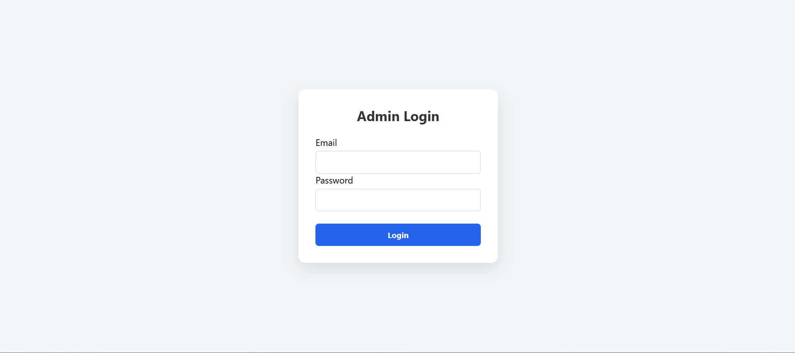
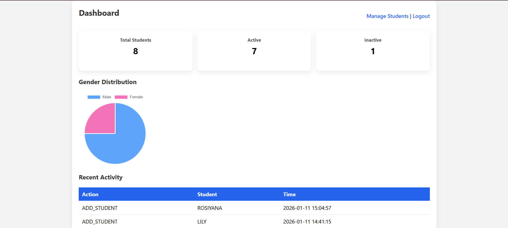
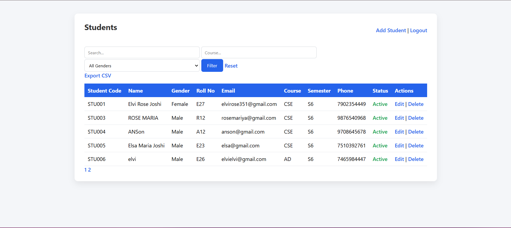
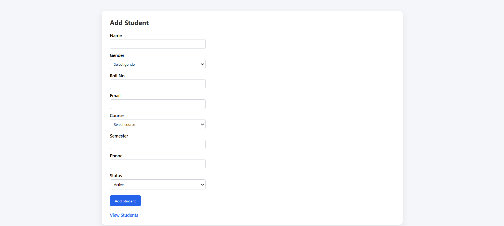
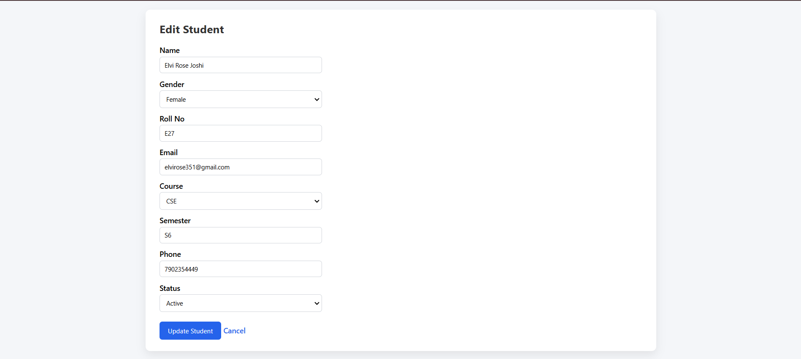

# 🎓 Student Management System

A full-featured web-based Student Management System built using PHP and MySQL to help administrators efficiently manage student records with validation, filtering, and analytics.

---

## 🚀 Features

- Secure admin login system
- Add, edit, view, and soft-delete students
- Gender-based student classification
- Search and filter students by name, email, course, and gender
- Pagination for large student datasets
- Export student records to CSV
- Dashboard with analytics and charts
- Audit logs to track admin actions
- Input validation for email, phone number, and roll number
- Clean and responsive UI

---

## 🛠️ Tech Stack

| Layer | Technology |
|------|-----------|
Frontend | HTML, CSS |
Backend | PHP |
Database | MySQL |
Charts | Chart.js |
Server | XAMPP (Apache + MySQL) |
Version Control | Git + GitHub |

---

## 📂 Project Structure

```
student_managment/
│
├── add_student.php
├── edit_student.php
├── delete_student.php
├── students.php
├── dashboard.php
├── export.php
├── login.php
├── logout.php
├── index.php
├── config.php
├── style.css
├── README.md
└── .gitignore
```

---

## ⚙️ Installation & Setup

1. Install XAMPP from https://www.apachefriends.org
2. Start Apache and MySQL from XAMPP control panel
3. Clone or download this repository into:
   ```
   C:\xampp\htdocs\
   ```
4. Create a MySQL database named:
   ```
   student_management
   ```
5. Import the provided SQL file or manually create tables.
6. Configure database connection in `config.php`.
7. Open browser and go to:
   ```
   http://localhost/student_managment
   ```

---

## 📊 Dashboard

- Displays total, active, and inactive students
- Shows gender distribution using pie chart
- Shows recent admin activity logs

---

## 🧪 Validations

- Email must be valid format
- Phone number must be 10 digits
- Roll number must be uppercase alphanumeric
- Duplicate emails are not allowed

---

## 📈 Analytics

- Gender distribution visualization
- Activity tracking using audit logs
- CSV export for external analysis

---

## 📸 Screenshots

### Login Page


### Dashboard


### Students List


### Students Add


### Students Edit


---

## 🧩 Future Enhancements

- Role-based access (Admin, Staff)
- Student photo uploads
- Attendance management
- Email notifications
- REST API support
- Dark mode

---

## 🙋 Author

**Elvi Rose Joshi**  
GitHub: https://github.com/Elvirose


